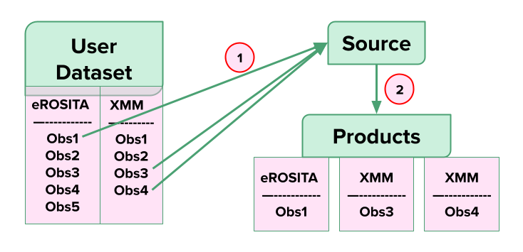

Introduction to XGA
===================

X-ray: Generate and Analyse (XGA) is a Python module designed to make it easy to analyse X-ray sources.
It is based around declaring different types of source and sample objects which correspond to real X-ray sources, 
finding all available data, and then insulating the user from the tedious generation and basic analysis of X-ray data products 
(though with the option to get stuck into the data directly if required). XGA provides an easy to use Python interface with
telescope specific software (XMM's Science Analysis System (SAS), eROSITA's eROSITA Science Analysis Software System (eSASS), and XSPEC),
where all generation and fitting procedures have been parallelised as much as is possible. A major goal of this module is that you 
shouldn't need to leave a Python environment at any point during your analysis, as all XGA products and fit results are read into 
an XGA source storage structure. It is not a pipeline in itself, as it can be used for interactive analyses in Jupyter Notebooks, however it is
quite possible to build pipeline's using XGA's features and methods. 

Generating
----------

XGA will generate photometric products (images, exposure maps, and rate maps), spectra, and lightcurves for individual sources,
or whole samples, with just a few lines of code. XGA generated products are then saved into the source storage structure, so that
they may be viewed and plotted within Python, and used in subsequent analysis.

Analysing
---------

This module also supports more complex analyses for specific object types; the easy generation of scaling relations,
the measurement of gas masses for galaxy clusters, and the PSF correction of images for instance. It is also
possible, for extended sources (such as galaxy clusters), to generate and fit sets of annular spectra. This allows you
to investigate how properties change radially with distance from the centre, and enables the measurement of hydrostatic
masses of clusters.

Multi-Mission XGA
-----------------

The user may provide XGA with a dataset containing observations from multiple X-ray missions, so that any 
product generatation and analysis will utilise all the X-ray missions the user has data for. 
Currently XGA supports XMM and eROSITA. Combining products from different telescopes is not yet possible 
through XGA. To see full details of XGA treatment of different missions see the :doc:`multi` section.

For example in the diagram below, at step 1, the user is declaring a source. XGA searches the dataset
and find that the source lies in one eROSITA observation (Obs1), and two XMM observations (Obs3, and Obs4). Then in step 2
when the user uses XGA to make a product for that source, three products are made for each associated observation.

Crediting
---------

While XGA is a piece of open source software, I would appreciate it if any work that makes use of it would cite the
paper accompanying this package, which can be found in the :doc:`publications` section.

Contributing
------------

If wish to contribute to XGA, have feature suggestions, or any comments at all, then please go to the
"Getting Support" section and submit an issue on GitHub/send me an email, I'll be happy to hear from you!