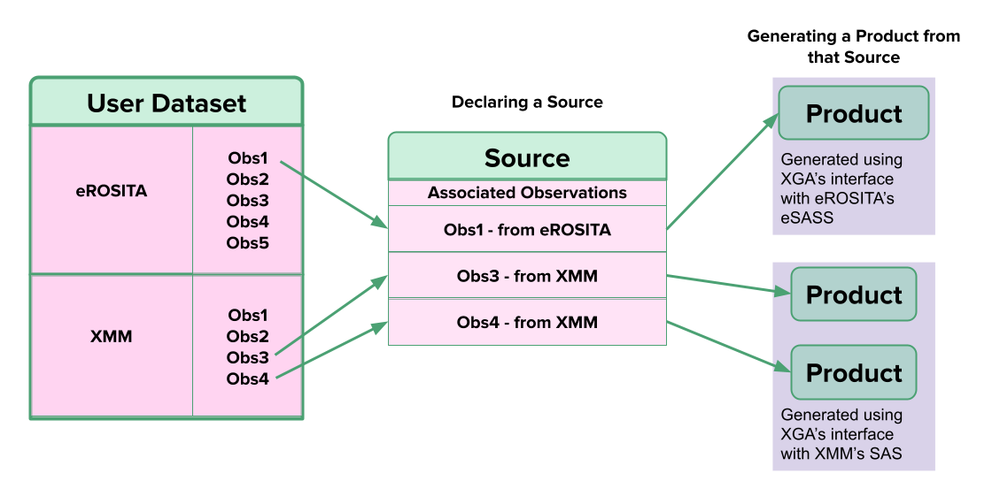

Introduction to XGA
===================

X-ray: Generate and Analyse (XGA) is an open source Python module designed for astronomers with the aim to make X-ray astronomy accessible, transparent, and reproducible.
The main ethos of XGA is to facilitate serendipitous science so that the public X-ray Archive may be fully exploited. It does this by shielding the user from tedious telescope software 
interaction, and provides a consistent Python interface to generate and analyse X-ray sources from an X-ray dataset. Astronomers across all levels of expertise may use XGA, as it's API is flexible 
to the users' knowledge base. 

How to Use XGA
---------------
XGA is an object-orientated module, where the user may declare different types of source and sample objects which correspond to real X-ray sources.  
Upon instantiation, XGA will find all available data containing these sources, and then insulate the user from interaction with telescope-specific software
when generating data products such as images and spectra (to name a few). Analysis of these products can also be done through XGA's API - for example fitting models to spectra performed by XSPEC behind the scenes.
A major goal of this module is that the user shouldn't need to leave a Python environment at any point during X-ray analysis, as all XGA products and fit results are read into 
an XGA source storage structure. 

All generation and fitting procedures have been parallelised as much as is possible, making it a useful tool for pipeline analyses of large samples of sources.
XGA is also perfect for investigations of indiviual objects, as all generated products are accessed easily, viewed, and fitted through XGA's inbuilt functions. 

Generating
----------

For both individual sources or whole samples, all through a consistent Python interface, XGA can generate:

* Images
* Exposure maps
* Rate maps
* Spectra
* Lightcurves

XGA generated products are then saved into the source storage structure, so that
they may be viewed and plotted within Python, and used in subsequent analysis.

Analysing
---------

Once the neccessary products have been generated, further analysis may be performed. Through XGA the user can:

* Fit models to spectra via XSPEC
* Yield temperature, luminosity, and photon index values from these fits
* Apply PSF corrections to images
* Calculate count rates and fluxes
* Find X-ray peaks of sources
* Fit radial profiles of temperature, density, and metallicity 

For specific source types, more complex analysis options are available. For galaxy clusters the user may:

* Generate scaling relations
* Measure a gas mass
* Fit sets of annular spectra (this can be done for any extended source)
* Measure a hydrostatic mass

Multi-Mission Data
------------------

The user may provide XGA with a dataset containing observations from multiple X-ray missions, so that any 
product generatation and analysis will utilise all the X-ray telescopes that the user has data for. 

Currently XGA supports interaction with:

* **XMM** via Science Analysis System (SAS)
* **eROSITA** via eROSITA Science Analysis Software System (eSASS) 

The long term aim is to support all X-ray telescope's data, if you are interested in helping integrate your favourite X-ray telescope please do get in contact. 
To see full details of XGA treatment of different missions see the :doc:`multi` section.

Crediting
---------

While XGA is a piece of open source software, it would be appreciated if any work that makes use of it would cite the
paper accompanying this package, which can be found in the :doc:`publications` section.

Contributing
------------

If you wish to contribute to XGA, have feature suggestions, or any comments at all, then please go to the
"Getting Support" section and submit an issue on GitHub/email the development team, we will be happy to hear from you!