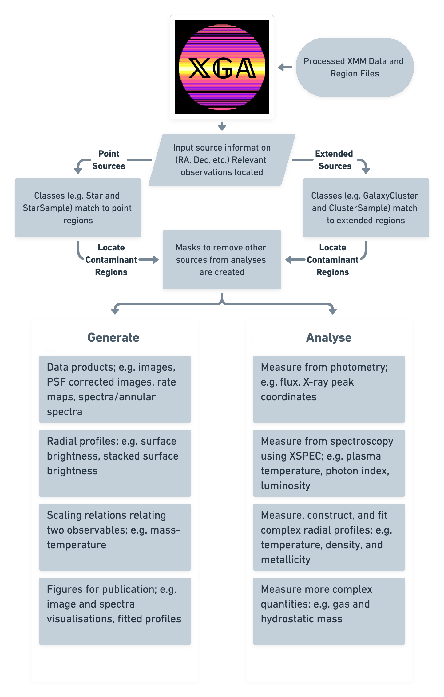

# Summary
The _XMM_ Cluster Survey [XCS, @xcsfoundation] have developed a new Python module (X-ray: Generate and Analyse, hereafter 
referred to as \texttt{XGA}) to provide interactive and automated analyses of X-ray emitting sources observed by the 
_XMM_-Newton space telescope. \texttt{XGA} only requires that a set of cleaned, processed, event lists has been created, and (optionally) that a 
source detector has generated region lists for the observations. \texttt{XGA} is centered around the concept of making 
all available data easily accessible and analysable. The user provides information (e.g. RA, Dec, redshift) on the 
source they wish to investigate, and \texttt{XGA} will locate all relevant observations and generate all required data products. This
approach means that the user can quickly and easily complete common analyses without manually searching through large amounts of archival
data for relevant observations, thus being left free to focus on extracting the maximum scientific gain. In the future, we 
will add support for X-ray telescopes other than _XMM_ (e.g. _Chandra_, _eROSITA_), as well as the ability to perform 
multi-mission joint analyses. With the advent of new X-ray observatories such as _eROSITA_ [@erosita], _XRISM_ [@xrism], 
_ATHENA_ [@athena], and _Lynx_ [@lynx], it is the perfect time for a new, open-source, software package that is open for 
anyone to use and scrutinise.

# Statement of need
X-ray telescopes allow for the investigation of some of the most extreme
objects and processes in the Universe; this includes galaxy clusters,
active galactic nuclei (AGN), and X-ray emitting stars. This makes the
analysis of X-ray observations useful for a variety of fields in
astrophysics and cosmology. Galaxy clusters, for instance, are useful as
astrophysical laboratories, and provide insight into how the Universe
has evolved during its lifetime.

Current generation X-ray telescopes have large archives of publicly
available observations; _XMM_-Newton has been observing for over
two decades, for instance. This allows for analysis of
large amounts of archival data, but also introduces issues with respect
to accessing and analysing all the relevant data for a particular
source. \texttt{XGA} solves this problem by automatically identifying
the relevant _XMM_ observations then generating whatever data
products the user requires; from images to sets of annular spectra. Once
the user has supplied cleaned event lists (and optionally region files)
an analysis region can be specified and spectra (along with any
auxiliary files that are required) can be created.

Software to generate X-ray data products is supplied by the telescope
teams, and most commands require significant setup and configuration.
The complexity only increases when analysing multiple observations of a
single source, as is often the case due to the large archive of data
available. \texttt{XGA} provides the user with an easy way to generate
_XMM_ data products for large samples of objects (which will scale
across multiple cores), while taking into account complex factors (such
as removing interloper sources) that vary from source to source.

[^*]: david.turner@sussex.ac.uk

# Features
\texttt{XGA} is centered around \texttt{source} and \texttt{sample}
classes. Different \texttt{source} classes, which represent different
types of X-ray emitting astrophysical objects, all have different
properties and methods. Some properties and methods are common to all sources, but some store quantities or perform measurements that are only relevant to a particular type of astronomical source.

\texttt{XGA} also contains \texttt{product} classes, which provide
interfaces to X-ray data products, with built-in methods for analysis,
manipulation, and visualisation. The \texttt{RateMap} (a count rate map
of a particular observation) class for instance includes view methods
(left hand side of \autoref{fig:rtspec}), methods for coordinate
conversion, and for measuring the peak of the X-ray emission. We also
provide classes for interacting with, analysing, and viewing spectra
(see right hand side of \autoref{fig:rtspec}), both global and annular; as such we can use
\texttt{XGA} to investigate both average properties and, in the case of
extended sources, how these properties vary radially. Similar
procedures for image based analysis are also available, where images
(and merged images from all available data for a given source) can be
easily generated en masse, then combined with masks automatically
generated from supplied region files to perform photometric analyses.

We also include a set of profile classes, with built-in viewing methods,
and a fitting method based around the \texttt{emcee} ensemble MCMC
sampler [@emcee]. Profiles also support storing and
interacting with fitted models; including integration and
differentiation methods, inverse abel transforms, and predictions from
the model. An example of the utility of these profiles is the galaxy
cluster hydrostatic mass measurement feature; this requires the
measurement of 3D gas density profiles, 3D temperature profiles, gas
mass, and total mass profiles.

To extract useful information from the generated spectra, we implemented
a method for fitting models, creating an interface with XSPEC [@xspec], a popular X-ray spectral fitting language. This interface
includes the ability to fit XSPEC models (e.g.~plasma emission and
blackbody) and simplifies interaction with the underlying software and
data by automatically performing simultaneous fits with all available
data. 

# Existing software packages
To the knowledge of the authors, no software package exists that
provides features completely equivalent to \texttt{XGA}, particularly in
the open source domain. That is not to say that there are no software
tools similar to the module that we have constructed; several research
groups including XCS [@xcsmethod], XXL [@xxllt], LoCuSS [@locusshydro], and the cluster group at UC Santa
Cruz [@matcha] have developed pipelines to measure the
luminosity and temperature of X-ray emitting galaxy clusters, though
these have not been made public. It is also important to note that these
pipelines are normally designed to measure a particular aspect of a
particular type of X-ray source (galaxy clusters in these cases), and as
such they lack the generality and flexibility of \texttt{XGA}. Our new
software is also designed to be used interactively, as well as a basis
for building pipelines such as these.

Some specific analyses built into \texttt{XGA} have comparable open
source software packages available; for instance \texttt{pyproffit} [@erositagasmass] is a recently released Python module that was
designed for the measurement of gas density from X-ray surface
brightness profiles of galaxy clusters. We do not believe that any existing X-ray analysis
module has an equivalent to the source and sample based structure which
\texttt{XGA} is built around, or to the product classes that have been
written to interact with X-ray data products.

The \texttt{XSPEC} [@xspec] interface we have developed for
\texttt{XGA} is far less comprehensive than the full Python wrapping
implemented in the \texttt{PyXspec} module, but scales with multiple
cores for the analysis of multiple sources simultaneously much more
easily.

# Research projects using \texttt{XGA}
\texttt{XGA} is stable and appropriate for scientific use, and as such
it has been used in several recent pieces of work; this has included an
_XMM_ analysis of the eFEDS cluster candidate catalogue [@efedsxcs], where we produced the first temperature calibration between _XMM_
and _eROSITA_, a multi-wavelength analysis of an ACT selected galaxy
cluster [@denisha], and _XMM_ follow-up of Dark Energy Survey
(DES) variability selected low-mass AGN candidates [@desagn].

There are also several projects that use \texttt{XGA} nearing
publication. The first of these is a hydrostatic and gas mass analysis
of the redMaPPeR [@redmappersdss] SDSS selected XCS galaxy cluster
sample [@sdssxcs] and well as the ACTDR5 [@actdr5] Sunyaev-Zel'dovich (SZ) selected XCS sample of galaxy clusters.
This work also compares commonly measured X-ray properties of clusters
(the X-ray luminosity $L_{\rm{x}}$, and the temperature
$T_{\rm{x}}$) both to results from the existing XCS pipeline and from
literature, confirming that \texttt{XGA} measurements are consistent
with previous work. This process is repeated with \texttt{XGA}'s galaxy cluster gas and hydrostatic mass measurements, again showing they are consistent with previous work. \texttt{XGA}'s ability to stack and
combine X-ray surface brightness profiles is currently being used, in
combination with weak lensing information from DES, to look for signs of
modified gravity in galaxy clusters.

# Future Work
In the future we intend to introduce support for the analysis of X-ray
telescopes other than _XMM_-Newton, first focusing on
_Chandra_ and _eROSITA_, and then possibly considering the
addition of other X-ray instruments. This will include the same ability
to find relevant data and generate data products as is already
implemented for _XMM_, and will also involve the introduction of
powerful multi-mission joint analyses to fully exploit the X-ray
archives. We are also happy to work
with others to introduce specific analysis features that aren't already
included in the module.

# Acknowledgements
David J. Turner (DT), Kathy Romer (KR), and Paul A. Giles (PG)
acknowledge support from the UK Science and Technology Facilities
Council via grants ST/P006760/1 (DT), ST/P000525/1 and ST/T000473/1 (PG,
KR).

David J. Turner would like to thank Aswin P. Vijayan, Lucas Porth, and
Tim Lingard for useful discussions during the course of writing this
module.

We acknowledge contributions to the _XMM_ Cluster Survey from A. Bermeo, M. Hilton, P. J. Rooney, S. Bhargava, L. Ebrahimpour, R. G. Mann, M. Manolopoulou, J. Mayers, E. W. Upsdell, C. Vergara, P. T. P. Viana, R. Wilkinson, C. A. Collins, R. C. Nichol, J. P. Stott, and others.

# References
